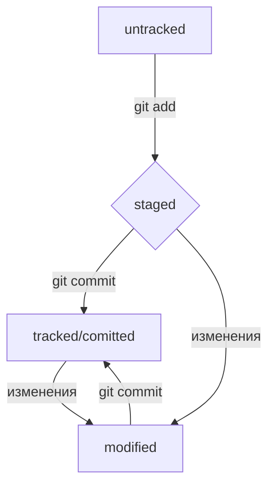

# Краткий справочник по Git


## Что такое Git


Git - это программа, обеспечивающая отслеживание изменений в программе. Один из продуктов VCS (Системы Контроля Версий). <br> 
Он позволяет:
1. Объединить коды нескольких разработчиков;  <br>
2. Отслеживать измения в коде и возвращаться к предудыщим вариантам кода;  <br>
3. Взаимодействовать, скачивать удаленные репозитории и делиться своими (локальными) с помощью Github. <br>


## Как работать в Git


По умолчанию интерфейс Git представляет из себя консоль. Чтобы работать в Git нужно вписывать в терминал команды. <br>
Командная строка принимает их от пользователя, преобразовывает, а после - выполняет.<br>


## Что такое коммиты?


Коммит - это что-то вроде сохранения изменений с комментарием. В программе он выглядит так: ```git commit -m "...."```. <br>
После ввода команды ```git add %...%```, файл добавляется в служебную папку ```.git```. Вы еще не сохранили изменения. Вы только сделали его отслеживаемым (tracked) для Системы Контроля Версий. <br>
Заключительный шаг за коммитом! При создании для каждого коммита присваивается определенный индефикационный "номер" - __хеш__. Хеш можно увидеть при вызове команды: <br>
- ```git log``` - тогда появится полный хеш;<br>
- ```git log --oneline``` - (One - "Одна", Line - "Линия") появится сокращенный хеш. Сокращенный хеш также является уникальным, как и полный, и поэтому им можно смело пользоваться.<br>
Если вы знаете хеш, вы можете узнать все остальное: автора, дату коммита и содержимое закоммиченных файлов. Хеши хранятся в папке ```.git```.


### Файл HEAD


Файл HEAD ("голова", "головной") - один из слежебных файлов папки ```.git```. Он указывает на коммит, который сделан последним, т.е. на самый новый. <br>
Внутри HEAD - ссылка на служебный файл: refs/heads/master. Если заглянуть в этот файл, то можно увидеть хеш последнего коммита. <br>


## Статусы (жизненный цикл файлов в Git) 


* ```untracked``` ("неотслеживаемый")<br>
Это означает, что Git "видит" новый файл в репозитории, но не следит за изменениями в нем. У untracked-файла нет предыдущих версий, зафиксированных с помощью ```git add``` или коммитах<br>


* ```staged``` ("подготовленный")<br>
После выполнения команды ```git add``` файл попадает в staging area (stage - "Сцена", area - "область"), т.е. в список файлов, которые войдут в коммит. В этом моменте файл находится в состоянии staged.<br>
Если коммит можно сравнивать со сделанной фотографией, то ```git add``` добавляет персонажей на __сцену__ (stage) для общей фотографии<br>


* ```tracked``` ("отслеживаемый")<br>
Состояние ```tracked``` - это полная противоположность ```untracked```. В это состояние попадают файлы, которые уже были зафиксированы с помощью ```git commit```, <br>
а также все файлы, которые были добавлены в __*staging area*__ командой ```git add```.<br>


* ```modified``` ("измененный")<br>
Состояние ```modified``` означает что Git сравнил содержимое файла с последней сохраненной версией и нашел отличия. Например, файл был закоммичен и после этого изменен.<br>


### Про ```staged``` и ```modified```


Команда ```git add``` добавляет в __*staging area*__ только текущее содержимое файла. Если вы, например, сделаете ```git add file.txt```, а затем измените ```file.txt```, <br>
то новое содержимое файла не будет находиться в __*staging area*__. <br>
Git сообщит об этом с помощью статуса modofied: файл изменен относительно той версии, которая уже в __*staging*__. <br>
Чтобы добавить в __*staging*__ последнюю версию, нужно выполнить ```git add file.txt``` еще раз. <br>


---





---


## Список команд в Git


---

### Базовые
1. ```cd %Имя_директории%``` - (Change directory - "Поменять директорию") перемещает в директорию, находящуюся на один уровень ниже или выше. Чтобы перенестись на несколько директорий нужно использовать знак - / <br>
```cd .. ``` - переносит в директорию, стоящую на один уровень выше;  <br>
```cd ~``` - переносит в домашнюю директорию, в директорию пользователся (USER);<br>
```cd /c``` - переносит в корневую директорию, самую высшую.<br>


2. ```pwd``` - (print working directory - "вывести рабочую директорию") выводит в какой папке вы сейчас находитесь;<br>


3. ```ls``` - List directory contens - "Отобразить содержимое директории";  <br>
```ls``` с флагом -a выведет расширенный список содержимого (+ скрытые файлы) <br>


4. ```touch %Имя_файла%``` - ("коснуться") создает файл с указанным расширением (можно использовать с символами ~ и .. , чтобы создавать файлы в род. и предыдущей директориях соответственно).<br>


5. ```mkdir %Имя_файла%``` - (make directory - "создать директорию") создает папку (можно использовать с символами ~ и .. , чтобы создавать файлы в род. и предыдущей директориях соответственно);<br>
Ключ -p позволяет создать сразу структуру директорий. <br>


6. ```cp %Что_копирует% %...% %...% %куда_копирует%``` - ( copy - "копировать") копирует файлы и директории сохраняет их в другой папке (можно копировать как один файл, так и сразу несколько) <br>


7. ```Cat %Имя_файла%``` - (con__cat__enate and print - "объединить и распечатать") считывает __текстовые__ файлы <br>


8. ```rm %Имя_файла%``` - (remove - "удалить") удаляет файл;<br>
```rmdir``` - удаляет директорию;<br>
```rm - r``` - (recursive - "рекурсивный") удаляет последовательно каждый элемент в папке.<br>


### Для работы с удаленным репозиторием
1. ```git init``` - (от англ. инициализировать) делает из папки git-репозиторий (от англ. repository — «хранилище»), создавая в ней скрытую папку ```.git```. Она нужна чтобы хранить файлы и позволить VCS взаимодействовать с ними. <br>


2. ```rm -rf .git```  - позволяет разгидить папку (если репозиторий был создан по ошибке), удалив из нее скрытую директорию ```.git```<br>
```-r``` (recursive - "рекурсивно") позволяет удалять папки вместе с их содержимым<br>
```-f``` (force - "заставить") избавляет вас от вопросов вроде "Вы точно хотите удалить этот файл? А этот? И этот тоже?"<br>


3. ```git status``` - если кратко, то выводит следующую информацию:<br>
(1) On branch master - название текущей ветки<br>
(2) Сообщение о коммитах<br>
(3) Сообщение, которое говорит: "чтобы что-то закоммитить (то есть зафиксировать), нужно сначала это создать<br>


4. ```git add %Имя_файла%``` - добавляет файл из папки в скр. директорию .git;<br>
```git add --all``` - добавляет все файлы в папку .git; <br>
```git add .``` - добавляет текущую папку в директорию .git.<br>


5. ```git commit -m %Имя_файла%``` - (message - "сообщение") сохраняет измения файла с пояснением в папку.git. <br>
```git commit --amend --no-edit``` - (от англ. amend — «исправить», «дополнить»; no-edit - "нет правок") позволяет добавить новый файл в последний коммит. ```no-edit``` говорит нам о том, 
что мы не собираемся изменять сделанное нами сообщение. Если вместо ```no-edit``` будет флаг ```-m```, то сообщение будет изменено на то, которое мы укажем. Если на место ключа ничего не поставить, 
то будут вызваны текстовые редакторы по умолчанию, с помощью которых можно изменить текст комментария. 
Эта команда работает только с последним коммитом (HEAD).


6. ```git restore --staged <file>``` - (от англ. restore — «восстановить») сбрасывает файл из ```staged``` (__*staging area*__) статуса обратно в ```untracked``` или ```modified``` статус.<br>
Чтобы сбросить все файлы из ```staged``` обратно в ```untracked``` или ```modified``` можно воспользоваться командой ```git restore --staged .```: она сбросить из __*staging area*__ всю текущую папку (```.```)<br>


7. ```git reset --hard %Хеш_коммита%``` - (от англ. reset  — «сброс», «обнуление» и hard — «суровый») возвращает код к более раннему варианту, сбрасывая все сохранения, сделанные благодаря коммитам, <br>
до указанного сохранения. Все последующие версии кода, коммиты эта команда удаляет.<br>


8. ```git restore %file%``` - Если файл был случайно, или нет, изменен и его статус стал ```modified```, то эта команда помогает вернуть код до последней сохраненной версии (возвращает его в последнюю ```tracked```-версию, т.е.<br>
которая была сохранена с помощью git commit или git add).<br>


9. ```git diff``` - (от англ. difference — «отличие», «разница») эта команда сравнивает последнюю закоммиченную версию файла с текущей. ```git diff``` не показывает изменения в ```staged```-файлах. <br>
Чтобы посмотреть изменения в ```staged``` нужно использовать эту команду с флагом ```--staged```: ```git diff --staged```.<br>
Передайте ```git diff``` хеши обоих коммитов. Состояние файлов на момент первого переданного коммита будет сравниваться с состоянием файлов на момент второго.<br>
Вместо хеша последнего коммита можно использовать ```HEAD```.<br>
__По сути команда ```git diff A B``` выводит список инструкций: как из состояния А получить состояние В. Если поменять хеши местами (```git diff B A```), то команда подскажет, как из Б получить А.__<br>


10. ```echo "..."``` - (англ. «эхо») выводит в консоль то, что ей передали в качестве параметра.<br>
```echo "..." >> %Имя_файла%``` - записывает в конец файла то, что ей передали в качестве параметра.<br>
```echo "..." > %Имя_файла%``` - стирает содержимое файла, а затем передает в него то, что передали в качестве параметра.<br>


11. ```git log``` - (log - "Журнал") выводит все сделанные коммиты. По умолчанию они выводятся в обратном хронологическом порядке.<br>
```git log --oneline``` - (сокращенный журнал) в терминале появится первые несколько символом хеша акждого коммита и их комментарии.<br>


12. ```ls -la .ssh/``` - выводит содержимое папки .ssh.<br>


13. ```ssh-keygen``` - генерирует ssh ключи.<br>


14. ```git remote add origin %URL удаленного репозитория%``` (origin - "источник" - стандартный псевдоним удаленного репозитория) - (от англ. remote — «удалённый» и add — «добавить») <br>
привязывает удаленный репозиторий к локальному.<br>


15. ```git remote -v``` (-v -короткая форма флага --verbose "подробный", позволяет показать больше информации в выводе) - выводит две строчки. Если строчки совпадают, позволяет нам убедиться что репозитории связаны.<br>


16. ```git push -u origin master``` - ("толкать") загружает содержимое локального репозитория на github.<br>
В первый раз эту команду нужно вызвать с флагом ```-u``` и параметрами origin (имя удалённого репозитория) и main или master (название текущей ветки). Флаг -u свяжет локальную ветку с одноимённой удалённой. <br>
В послудующие разы можно просто писать - ```git push```<br>


---


## Хронология загрузки файла в удаленный репозиторий

1. Работаем с файлом, корректируем его<br>
2. Добавляем его в папку ```.git``` (```git add %Имя_файла%```)<br>
3. Сохраняем изменения с пояснением - делаем коммит (```git commit -m "...."```)<br>
4. Связываем удаленный репозиторий и локальный (```git remote add origin %URL удаленного репозитория%```) <br>
5. Загружаем файл на удаленный репозиторий (```git push -u origin master``` или ```git push```)<br>

## Дополнительно
- SSH ключи - (от англ. Secure Shell Protocol) это сетевой протокол. Когда компьютеры обмениваются данными в сети, они следуют сетевым протоколам (англ. network protocols) - правилам обмена данными между компьютерами. <br>
Он обеспечивает безопасный обмен данными в сети. <br>
- SSH использует пару ключей для обеспечения безопасности — публичный и приватный.<br>
Оба типа этих ключей находятся в папке .ssh, которая в свою очередь находится по умолчанию в домашней директории.<br>
- Untracked files - неотслеживаемые файлы. Надпись появляется при вызове команды git status, когда есть файлы, которые не отслеживает VCS